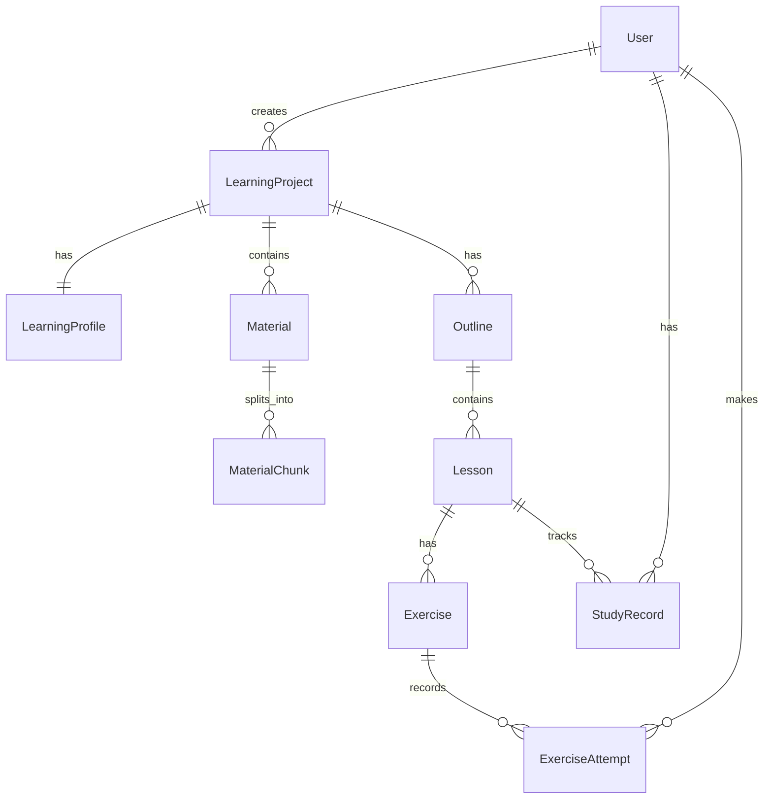

# 智学平台 Prisma Schema 设计

> [!abstract] 文档概述
> 本文档定义智学平台的数据库 Schema，使用 Prisma ORM。
> 基于 PostgreSQL + pgvector 实现。
>
> **相关文档**：[[技术架构方案]] | [[需求文档]]

---

## Schema 文件

```prisma
// schema.prisma

generator client {
  provider = "prisma-client-js"
  previewFeatures = ["postgresqlExtensions"]
}

datasource db {
  provider = "postgresql"
  url      = env("DATABASE_URL")
  extensions = [vector]
}

// ============================================
// 用户相关
// ============================================

model User {
  id        String   @id @default(cuid())
  username  String   @unique
  email     String?  @unique
  createdAt DateTime @default(now())
  updatedAt DateTime @updatedAt

  // 关联
  projects       LearningProject[]
  studyRecords   StudyRecord[]
  exerciseAttempts ExerciseAttempt[]

  @@map("users")
}

// ============================================
// 学习项目
// ============================================

model LearningProject {
  id              String   @id @default(cuid())
  userId          String
  title           String
  status          String   @default("active") // active, completed, archived
  currentLessonId String?
  createdAt       DateTime @default(now())
  updatedAt       DateTime @updatedAt

  // 关联
  user            User              @relation(fields: [userId], references: [id], onDelete: Cascade)
  profile         LearningProfile?
  materials       Material[]
  outlines        Outline[]

  @@index([userId])
  @@map("learning_projects")
}

// ============================================
// 学习画像
// ============================================

model LearningProfile {
  id            String   @id @default(cuid())
  projectId     String   @unique
  topic         String
  goal          String   @db.Text
  currentLevel  String   // beginner, intermediate, advanced
  timeBudget    Int      // 每周小时数
  learningStyle String?  // visual, practical, theoretical
  preferences   Json?    // 其他偏好设置
  createdAt     DateTime @default(now())

  // 关联
  project       LearningProject @relation(fields: [projectId], references: [id], onDelete: Cascade)

  @@map("learning_profiles")
}

// ============================================
// 学习资料
// ============================================

model Material {
  id           String   @id @default(cuid())
  projectId    String
  filename     String
  fileType     String   // txt, md, pdf
  filePath     String
  fileSize     Int
  parseStatus  String   @default("pending") // pending, processing, completed, failed
  extractedText String? @db.Text
  metadata     Json?
  createdAt    DateTime @default(now())

  // 关联
  project      LearningProject @relation(fields: [projectId], references: [id], onDelete: Cascade)
  chunks       MaterialChunk[]

  @@index([projectId])
  @@map("materials")
}

// ============================================
// 资料分块（向量存储）
// ============================================

model MaterialChunk {
  id         String                     @id @default(cuid())
  materialId String
  chunkText  String                     @db.Text
  chunkIndex Int
  embedding  Unsupported("vector(1536)")?
  metadata   Json?
  createdAt  DateTime                   @default(now())

  // 关联
  material   Material @relation(fields: [materialId], references: [id], onDelete: Cascade)

  @@index([materialId])
  @@map("material_chunks")
}

// ============================================
// 学习大纲
// ============================================

model Outline {
  id        String   @id @default(cuid())
  projectId String
  version   Int      @default(1)
  content   Json     // 大纲结构 JSON
  isActive  Boolean  @default(true)
  createdAt DateTime @default(now())

  // 关联
  project   LearningProject @relation(fields: [projectId], references: [id], onDelete: Cascade)
  lessons   Lesson[]

  @@index([projectId])
  @@map("outlines")
}

// ============================================
// 课程章节
// ============================================

model Lesson {
  id               String   @id @default(cuid())
  outlineId        String
  title            String
  orderIndex       Int
  objective        String?  @db.Text
  prerequisites    String[] // 前置知识点数组
  content          String?  @db.Text
  examples         Json?    // 示例 JSON
  summary          String?  @db.Text
  estimatedMinutes Int?
  createdAt        DateTime @default(now())

  // 关联
  outline          Outline           @relation(fields: [outlineId], references: [id], onDelete: Cascade)
  exercises        Exercise[]
  studyRecords     StudyRecord[]

  @@index([outlineId])
  @@map("lessons")
}

// ============================================
// 练习题
// ============================================

model Exercise {
  id            String   @id @default(cuid())
  lessonId      String
  type          String   // multiple_choice, fill_blank, code_completion, short_answer
  question      String   @db.Text
  options       Json?    // 选择题选项
  correctAnswer String   @db.Text
  explanation   String?  @db.Text
  difficulty    String?  // easy, medium, hard
  createdAt     DateTime @default(now())

  // 关联
  lesson        Lesson            @relation(fields: [lessonId], references: [id], onDelete: Cascade)
  attempts      ExerciseAttempt[]

  @@index([lessonId])
  @@map("exercises")
}

// ============================================
// 学习记录
// ============================================

model StudyRecord {
  id          String    @id @default(cuid())
  userId      String
  lessonId    String
  status      String    @default("in_progress") // in_progress, completed
  studyTime   Int       @default(0) // 秒
  completedAt DateTime?
  createdAt   DateTime  @default(now())

  // 关联
  user        User   @relation(fields: [userId], references: [id], onDelete: Cascade)
  lesson      Lesson @relation(fields: [lessonId], references: [id], onDelete: Cascade)

  @@unique([userId, lessonId])
  @@index([userId])
  @@index([lessonId])
  @@map("study_records")
}

// ============================================
// 练习题作答记录
// ============================================

model ExerciseAttempt {
  id          String   @id @default(cuid())
  userId      String
  exerciseId  String
  userAnswer  String   @db.Text
  isCorrect   Boolean
  feedback    String?  @db.Text
  attemptedAt DateTime @default(now())

  // 关联
  user        User     @relation(fields: [userId], references: [id], onDelete: Cascade)
  exercise    Exercise @relation(fields: [exerciseId], references: [id], onDelete: Cascade)

  @@index([userId])
  @@index([exerciseId])
  @@map("exercise_attempts")
}
```

---

## 使用说明

### 初始化数据库

```bash
# 安装依赖
npm install prisma @prisma/client

# 初始化 Prisma
npx prisma init

# 生成 Prisma Client
npx prisma generate

# 创建迁移
npx prisma migrate dev --name init

# 查看数据库
npx prisma studio
```

### 启用 pgvector 扩展

```sql
-- 在 PostgreSQL 中执行
CREATE EXTENSION IF NOT EXISTS vector;
```

---

## 数据关系图



---

## 关键设计说明

> [!tip] 向量存储
> `MaterialChunk.embedding` 使用 `vector(1536)` 类型，对应 OpenAI `text-embedding-3-small` 模型的维度。

> [!note] 级联删除
> 所有关联都设置了 `onDelete: Cascade`，删除父记录时自动删除子记录。

> [!warning] 索引优化
> 为常用查询字段添加了索引：
> - `userId` - 用户相关查询
> - `projectId` - 项目相关查询
> - `lessonId` - 课程相关查询

---

## 常用查询示例

### 创建学习项目

```typescript
const project = await prisma.learningProject.create({
  data: {
    userId: user.id,
    title: "Python 自动化学习",
    profile: {
      create: {
        topic: "Python",
        goal: "掌握办公自动化",
        currentLevel: "beginner",
        timeBudget: 5
      }
    }
  },
  include: {
    profile: true
  }
})
```

### 获取学习进度

```typescript
const progress = await prisma.studyRecord.findMany({
  where: {
    userId: user.id,
    lesson: {
      outline: {
        projectId: project.id
      }
    }
  },
  include: {
    lesson: true
  }
})

const completedCount = progress.filter(r => r.status === 'completed').length
const totalCount = progress.length
const completionRate = (completedCount / totalCount) * 100
```

### 向量检索

```typescript
// 注意：向量检索需要使用原生 SQL
const chunks = await prisma.$queryRaw`
  SELECT id, chunk_text, metadata,
         1 - (embedding <=> ${queryEmbedding}::vector) as similarity
  FROM material_chunks
  WHERE material_id = ${materialId}
  ORDER BY embedding <=> ${queryEmbedding}::vector
  LIMIT 5
`
```

---

## 更新日志

### 2026-03-09
- 初始版本
- 定义核心表结构
- 添加向量存储支持
- 添加索引优化

