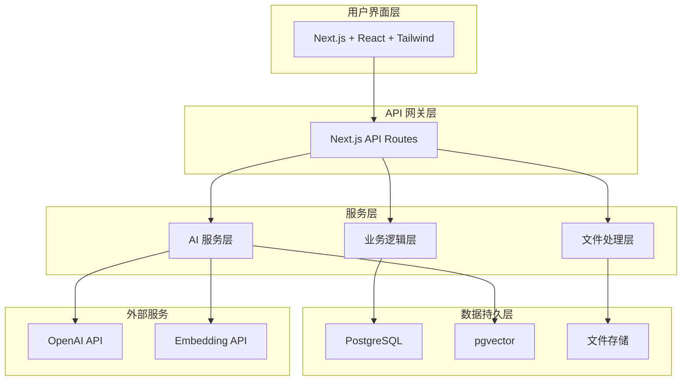
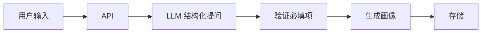

# 智学 AI 学习平台技术架构方案

> [!abstract] 文档概述
> 本文档描述智学 AI 个性化学习平台的技术架构设计，包括系统架构、技术栈选型、核心模块设计、数据流转、部署方案等。
>
> **相关文档**：[[智学产品方案]] | [[需求文档]]

## 目录

- [[#1. 架构设计原则]]
- [[#2. 系统架构概览]]
- [[#3. 技术栈选型]]
- [[#4. 核心模块设计]]
  - [[#4.1 学习目标分析模块]]
  - [[#4.2 资料解析模块]]
  - [[#4.3 课程生成模块]]
  - [[#4.4 练习题生成与评估模块]]
  - [[#4.5 学习进度管理模块]]
- [[#5. 数据库设计]]
- [[#6. API 设计]]
- [[#7. AI Prompt 设计策略]]
- [[#8. 部署方案]]
- [[#9. 性能优化]]
- [[#10. 安全考虑]]
- [[#11. 监控与日志]]
- [[#12. 开发路线图]]
- [[#13. 技术风险与应对]]
- [[#14. 总结]]

---

## 1. 架构设计原则

> [!tip] 核心原则
> - **简单优先**：个人项目，避免过度设计
> - **成本可控**：优先使用开源方案和低成本服务
> - **快速迭代**：架构支持快速验证和调整
> - **可扩展性**：预留扩展空间，但不提前实现

> [!info] 技术选型原则
> - 优先选择成熟稳定的技术栈
> - 优先选择开发效率高的框架
> - 优先选择社区活跃的工具
> - 避免引入过多依赖

---

## 2. 系统架构概览

### 2.1 整体架构



> [!note] 架构说明
> - **用户界面层**：负责页面渲染和用户交互
> - **API 网关层**：统一处理请求路由和鉴权
> - **业务逻辑层**：核心业务逻辑处理
> - **AI 服务层**：封装所有 AI 相关功能
> - **文件处理层**：处理文件上传和解析
> - **数据持久层**：数据存储和检索
> - **外部服务层**：第三方 API 调用

---

## 3. 技术栈选型

### 3.1 前端技术栈

| 技术 | 版本 | 用途 | 选型理由 |
|------|------|------|----------|
| Next.js | 14+ | 全栈框架 | SSR/SSG 支持，API Routes 方便 |
| React | 18+ | UI 框架 | 生态成熟，组件化开发 |
| TypeScript | 5+ | 类型系统 | 提高代码质量和可维护性 |
| Tailwind CSS | 3+ | 样式框架 | 快速开发，样式一致性好 |
| shadcn/ui | latest | 组件库 | 开箱即用，可定制性强 |
| Zustand | latest | 状态管理 | 轻量简单，适合中小项目 |

### 3.2 后端技术栈

| 技术 | 版本 | 用途 | 选型理由 |
|------|------|------|----------|
| Next.js API Routes | 14+ | API 服务 | 与前端统一，部署简单 |
| Prisma | 5+ | ORM | 类型安全，迁移方便 |
| PostgreSQL | 15+ | 关系数据库 | 成熟稳定，支持 JSON |
| pgvector | latest | 向量存储 | 与 PG 集成，无需额外服务 |
| Zod | latest | 数据验证 | 类型安全的数据校验 |

### 3.3 AI 技术栈

| 技术 | 用途 | 选型理由 |
|------|------|----------|
| OpenAI API | LLM 调用 | 效果好，API 稳定 |
| LangChain | AI 编排 | 简化 RAG 和 Agent 开发 |
| text-embedding-3-small | 文本向量化 | 性价比高 |
| gpt-4o-mini | 课程生成 | 成本低，效果够用 |
| gpt-4o | 复杂任务 | 质量要求高的场景 |

### 3.4 文件处理技术栈

| 技术 | 用途 | 选型理由 |
|------|------|----------|
| pdf-parse | PDF 解析 | 轻量，支持文本提取 |
| mammoth | DOCX 解析 | 转 HTML，保留格式 |
| marked | Markdown 解析 | 标准库，功能完善 |

---

## 4. 核心模块设计

### 4.1 学习目标分析模块

> [!info] 功能说明
> - 通过结构化问答收集用户学习需求
> - 生成学习画像

#### 技术实现

```typescript
// 服务接口
interface LearningGoalService {
  // 开始问答会话
  startQuestionnaire(userId: string): Promise<Session>

  // 处理用户回答
  processAnswer(sessionId: string, answer: Answer): Promise<NextQuestion>

  // 生成学习画像
  generateProfile(sessionId: string): Promise<LearningProfile>
}
```

> [!tip] Prompt 设计要点
> - 使用结构化 Prompt 引导 AI 提问
> - 必答字段验证逻辑
> - 生成 JSON 格式的学习画像

#### 数据流



---

### 4.2 资料解析模块

#### 功能
- 上传文件（PDF/TXT/MD）
- 提取文本内容
- 生成学习大纲

#### 技术实现
```typescript
interface MaterialParserService {
  // 上传文件
  uploadFile(file: File, projectId: string): Promise<Material>

  // 解析文件内容
  parseFile(materialId: string): Promise<ParsedContent>

  // 生成学习大纲
  generateOutline(materialId: string, profile: LearningProfile): Promise<Outline>
}

// 解析流程
class MaterialParser {
  async parse(file: File): Promise<ParsedContent> {
    // 1. 检测文件类型
    const type = this.detectFileType(file)

    // 2. 提取文本
    const text = await this.extractText(file, type)

    // 3. 清洗文本
    const cleaned = this.cleanText(text)

    // 4. 提取结构
    const structure = await this.extractStructure(cleaned)

    return { text: cleaned, structure }
  }
}
```

#### RAG 流程设计
```
文件上传 → 文本提取 → 分块 (Chunking) → 向量化 (Embedding)
→ 存储到 pgvector → 检索 → 生成大纲
```

#### 分块策略
- 按章节分块（优先）
- 按段落分块（备选）
- 每块 500-1000 tokens
- 保留 100 tokens 重叠

---

### 4.3 课程生成模块

#### 功能
- 根据大纲和资料生成课程内容
- 按章节生成学习材料
- 生成练习题

#### 技术实现
```typescript
interface CourseGeneratorService {
  // 生成完整课程
  generateCourse(outlineId: string): Promise<Course>

  // 生成单个章节
  generateLesson(lessonId: string): Promise<LessonContent>

  // 生成练习题
  generateExercises(lessonId: string, count: number): Promise<Exercise[]>
}
```

#### 课程生成 Prompt 模板
```typescript
const LESSON_TEMPLATE = {
  system: `你是一个专业的课程内容生成器。
  根据提供的资料和大纲，生成结构化的课程内容。`,

  structure: {
    objective: "本节学习目标（3-5条）",
    prerequisites: "前置知识点",
    content: "核心讲解内容",
    examples: "示例说明（2-3个）",
    commonMistakes: "常见错误",
    summary: "本节总结",
    nextHint: "下一节预告"
  }
}
```

#### 生成流程
```
检索相关资料片段 → 构建 Prompt → LLM 生成 → 验证结构
→ 补充缺失字段 → 存储
```

---

### 4.4 练习题生成与评估模块

#### 功能
- 生成不同类型的练习题
- 评估用户答案
- 提供反馈和建议

#### 技术实现
```typescript
interface ExerciseService {
  // 生成练习题
  generateExercise(lessonId: string, type: ExerciseType): Promise<Exercise>

  // 评估答案
  evaluateAnswer(exerciseId: string, answer: string): Promise<Evaluation>

  // 生成反馈
  generateFeedback(evaluation: Evaluation): Promise<Feedback>
}

// 题型定义
enum ExerciseType {
  MULTIPLE_CHOICE = 'multiple_choice',  // 选择题
  FILL_BLANK = 'fill_blank',            // 填空题
  CODE_COMPLETION = 'code_completion',  // 代码补全
  SHORT_ANSWER = 'short_answer'         // 简答题
}
```

#### 评估策略
- 选择题/填空题：精确匹配
- 代码题：使用 LLM 评估 + 关键点检查
- 简答题：使用 LLM 语义评估

---

### 4.5 学习进度管理模块

#### 功能
- 记录学习进度
- 断点续学
- 进度可视化

#### 技术实现
```typescript
interface ProgressService {
  // 更新学习进度
  updateProgress(userId: string, lessonId: string, status: Status): Promise<void>

  // 获取当前进度
  getCurrentProgress(userId: string, projectId: string): Promise<Progress>

  // 获取学习统计
  getStatistics(userId: string, projectId: string): Promise<Statistics>
}
```

#### 数据结构
```typescript
interface Progress {
  projectId: string
  currentLessonId: string
  completedLessons: string[]
  totalLessons: number
  completionRate: number
  studyTime: number
  lastStudyAt: Date
}
```

---

---

### 4.2 资料解析模块

#### 功能
- 上传文件（PDF/TXT/MD）
- 提取文本内容
- 生成学习大纲

#### 技术实现
```typescript
interface MaterialParserService {
  // 上传文件
  uploadFile(file: File, projectId: string): Promise<Material>

  // 解析文件内容
  parseFile(materialId: string): Promise<ParsedContent>

  // 生成学习大纲
  generateOutline(materialId: string, profile: LearningProfile): Promise<Outline>
}

// 解析流程
class MaterialParser {
  async parse(file: File): Promise<ParsedContent> {
    // 1. 检测文件类型
    const type = this.detectFileType(file)

    // 2. 提取文本
    const text = await this.extractText(file, type)

    // 3. 清洗文本
    const cleaned = this.cleanText(text)

    // 4. 提取结构
    const structure = await this.extractStructure(cleaned)

    return { text: cleaned, structure }
  }
}
```

#### RAG 流程设计
```
文件上传 → 文本提取 → 分块 (Chunking) → 向量化 (Embedding)
→ 存储到 pgvector → 检索 → 生成大纲
```

#### 分块策略
- 按章节分块（优先）
- 按段落分块（备选）
- 每块 500-1000 tokens
- 保留 100 tokens 重叠

---

### 4.3 课程生成模块

#### 功能
- 根据大纲和资料生成课程内容
- 按章节生成学习材料
- 生成练习题

#### 技术实现
```typescript
interface CourseGeneratorService {
  // 生成完整课程
  generateCourse(outlineId: string): Promise<Course>

  // 生成单个章节
  generateLesson(lessonId: string): Promise<LessonContent>

  // 生成练习题
  generateExercises(lessonId: string, count: number): Promise<Exercise[]>
}
```

#### 课程生成 Prompt 模板
```typescript
const LESSON_TEMPLATE = {
  system: `你是一个专业的课程内容生成器。
  根据提供的资料和大纲，生成结构化的课程内容。`,

  structure: {
    objective: "本节学习目标（3-5条）",
    prerequisites: "前置知识点",
    content: "核心讲解内容",
    examples: "示例说明（2-3个）",
    commonMistakes: "常见错误",
    summary: "本节总结",
    nextHint: "下一节预告"
  }
}
```

#### 生成流程
```
检索相关资料片段 → 构建 Prompt → LLM 生成 → 验证结构
→ 补充缺失字段 → 存储
```

---

### 4.4 练习题生成与评估模块

#### 功能
- 生成不同类型的练习题
- 评估用户答案
- 提供反馈和建议

#### 技术实现
```typescript
interface ExerciseService {
  // 生成练习题
  generateExercise(lessonId: string, type: ExerciseType): Promise<Exercise>

  // 评估答案
  evaluateAnswer(exerciseId: string, answer: string): Promise<Evaluation>

  // 生成反馈
  generateFeedback(evaluation: Evaluation): Promise<Feedback>
}

// 题型定义
enum ExerciseType {
  MULTIPLE_CHOICE = 'multiple_choice',  // 选择题
  FILL_BLANK = 'fill_blank',            // 填空题
  CODE_COMPLETION = 'code_completion',  // 代码补全
  SHORT_ANSWER = 'short_answer'         // 简答题
}
```

#### 评估策略
- 选择题/填空题：精确匹配
- 代码题：使用 LLM 评估 + 关键点检查
- 简答题：使用 LLM 语义评估

---

### 4.5 学习进度管理模块

#### 功能
- 记录学习进度
- 断点续学
- 进度可视化

#### 技术实现
```typescript
interface ProgressService {
  // 更新学习进度
  updateProgress(userId: string, lessonId: string, status: Status): Promise<void>

  // 获取当前进度
  getCurrentProgress(userId: string, projectId: string): Promise<Progress>

  // 获取学习统计
  getStatistics(userId: string, projectId: string): Promise<Statistics>
}
```

#### 数据结构
```typescript
interface Progress {
  projectId: string
  currentLessonId: string
  completedLessons: string[]
  totalLessons: number
  completionRate: number
  studyTime: number
  lastStudyAt: Date
}
```

---

## 5. 数据库设计

### 5.1 核心表结构

#### users 表
```sql
CREATE TABLE users (
  id UUID PRIMARY KEY DEFAULT gen_random_uuid(),
  username VARCHAR(50) UNIQUE NOT NULL,
  email VARCHAR(255) UNIQUE,
  created_at TIMESTAMP DEFAULT NOW(),
  updated_at TIMESTAMP DEFAULT NOW()
);
```

#### learning_projects 表
```sql
CREATE TABLE learning_projects (
  id UUID PRIMARY KEY DEFAULT gen_random_uuid(),
  user_id UUID REFERENCES users(id),
  title VARCHAR(255) NOT NULL,
  status VARCHAR(50) DEFAULT 'active',
  current_lesson_id UUID,
  created_at TIMESTAMP DEFAULT NOW(),
  updated_at TIMESTAMP DEFAULT NOW()
);
```

#### learning_profiles 表
```sql
CREATE TABLE learning_profiles (
  id UUID PRIMARY KEY DEFAULT gen_random_uuid(),
  project_id UUID REFERENCES learning_projects(id),
  topic VARCHAR(255) NOT NULL,
  goal TEXT NOT NULL,
  current_level VARCHAR(50),
  time_budget INTEGER, -- 每周小时数
  learning_style VARCHAR(50),
  preferences JSONB,
  created_at TIMESTAMP DEFAULT NOW()
);
```

#### materials 表
```sql
CREATE TABLE materials (
  id UUID PRIMARY KEY DEFAULT gen_random_uuid(),
  project_id UUID REFERENCES learning_projects(id),
  filename VARCHAR(255) NOT NULL,
  file_type VARCHAR(50),
  file_path TEXT,
  file_size INTEGER,
  parse_status VARCHAR(50) DEFAULT 'pending',
  extracted_text TEXT,
  metadata JSONB,
  created_at TIMESTAMP DEFAULT NOW()
);
```

#### outlines 表
```sql
CREATE TABLE outlines (
  id UUID PRIMARY KEY DEFAULT gen_random_uuid(),
  project_id UUID REFERENCES learning_projects(id),
  version INTEGER DEFAULT 1,
  content JSONB NOT NULL,
  is_active BOOLEAN DEFAULT true,
  created_at TIMESTAMP DEFAULT NOW()
);
```

#### lessons 表
```sql
CREATE TABLE lessons (
  id UUID PRIMARY KEY DEFAULT gen_random_uuid(),
  outline_id UUID REFERENCES outlines(id),
  title VARCHAR(255) NOT NULL,
  order_index INTEGER NOT NULL,
  objective TEXT,
  prerequisites TEXT[],
  content TEXT,
  examples JSONB,
  summary TEXT,
  estimated_minutes INTEGER,
  created_at TIMESTAMP DEFAULT NOW()
);
```

#### exercises 表
```sql
CREATE TABLE exercises (
  id UUID PRIMARY KEY DEFAULT gen_random_uuid(),
  lesson_id UUID REFERENCES lessons(id),
  type VARCHAR(50) NOT NULL,
  question TEXT NOT NULL,
  options JSONB, -- 选择题选项
  correct_answer TEXT,
  explanation TEXT,
  difficulty VARCHAR(50),
  created_at TIMESTAMP DEFAULT NOW()
);
```

#### study_records 表
```sql
CREATE TABLE study_records (
  id UUID PRIMARY KEY DEFAULT gen_random_uuid(),
  user_id UUID REFERENCES users(id),
  lesson_id UUID REFERENCES lessons(id),
  status VARCHAR(50) DEFAULT 'in_progress',
  study_time INTEGER DEFAULT 0, -- 秒
  completed_at TIMESTAMP,
  created_at TIMESTAMP DEFAULT NOW()
);
```

#### exercise_attempts 表
```sql
CREATE TABLE exercise_attempts (
  id UUID PRIMARY KEY DEFAULT gen_random_uuid(),
  user_id UUID REFERENCES users(id),
  exercise_id UUID REFERENCES exercises(id),
  user_answer TEXT,
  is_correct BOOLEAN,
  feedback TEXT,
  attempted_at TIMESTAMP DEFAULT NOW()
);
```

### 5.2 向量存储表

#### material_chunks 表
```sql
CREATE EXTENSION IF NOT EXISTS vector;

CREATE TABLE material_chunks (
  id UUID PRIMARY KEY DEFAULT gen_random_uuid(),
  material_id UUID REFERENCES materials(id),
  chunk_text TEXT NOT NULL,
  chunk_index INTEGER,
  embedding vector(1536), -- text-embedding-3-small 维度
  metadata JSONB,
  created_at TIMESTAMP DEFAULT NOW()
);

-- 创建向量索引
CREATE INDEX ON material_chunks USING ivfflat (embedding vector_cosine_ops);
```

---

## 6. API 设计

### 6.1 学习目标相关

```typescript
// 开始问答
POST /api/questionnaire/start
Response: { sessionId, firstQuestion }

// 提交答案
POST /api/questionnaire/answer
Body: { sessionId, answer }
Response: { nextQuestion, isComplete }

// 生成学习画像
POST /api/questionnaire/generate-profile
Body: { sessionId }
Response: { profile }
```

### 6.2 资料相关

```typescript
// 上传资料
POST /api/materials/upload
Body: FormData { file, projectId }
Response: { materialId, status }

// 解析资料
POST /api/materials/:id/parse
Response: { parseStatus, extractedText }

// 生成大纲
POST /api/materials/:id/generate-outline
Response: { outlineId, content }
```

### 6.3 课程相关

```typescript
// 生成课程
POST /api/courses/generate
Body: { outlineId }
Response: { courseId, lessons }

// 获取章节内容
GET /api/lessons/:id
Response: { lesson }

// 获取练习题
GET /api/lessons/:id/exercises
Response: { exercises }
```

### 6.4 学习进度相关

```typescript
// 更新进度
POST /api/progress/update
Body: { lessonId, status }
Response: { success }

// 获取当前进度
GET /api/progress/:projectId
Response: { progress }

// 提交练习答案
POST /api/exercises/:id/submit
Body: { answer }
Response: { isCorrect, feedback }
```

---

## 7. AI Prompt 设计策略

### 7.1 结构化输出

使用 JSON Schema 约束 AI 输出：

```typescript
const PROFILE_SCHEMA = {
  type: "object",
  properties: {
    topic: { type: "string" },
    goal: { type: "string" },
    currentLevel: { type: "string", enum: ["beginner", "intermediate", "advanced"] },
    timeBudget: { type: "number" },
    learningStyle: { type: "string" }
  },
  required: ["topic", "goal", "currentLevel", "timeBudget"]
}
```

### 7.2 Few-shot 示例

为关键任务提供示例：

```typescript
const OUTLINE_GENERATION_EXAMPLES = [
  {
    input: "Python 自动化学习资料",
    output: {
      chapters: [
        { title: "环境搭建", estimatedHours: 2 },
        { title: "基础语法", estimatedHours: 8 },
        // ...
      ]
    }
  }
]
```

### 7.3 错误处理

```typescript
async function generateWithRetry(prompt: string, maxRetries = 3) {
  for (let i = 0; i < maxRetries; i++) {
    try {
      const result = await llm.generate(prompt)
      const validated = validateSchema(result)
      return validated
    } catch (error) {
      if (i === maxRetries - 1) throw error
      // 调整 prompt 重试
    }
  }
}
```

---

## 8. 部署方案

### 8.1 开发环境

```bash
# 本地开发
- Next.js Dev Server (localhost:3000)
- PostgreSQL (Docker)
- 文件存储：本地文件系统
```

### 8.2 生产环境（推荐）

```
方案 1：Vercel + Supabase
- 前端：Vercel (自动部署)
- 数据库：Supabase (PostgreSQL + pgvector)
- 文件存储：Supabase Storage

方案 2：自托管
- 服务器：VPS (2C4G 起步)
- 数据库：自建 PostgreSQL
- 文件存储：本地磁盘
- 反向代理：Nginx
```

### 8.3 环境变量

```env
# 数据库
DATABASE_URL=postgresql://...

# OpenAI
OPENAI_API_KEY=sk-...
OPENAI_MODEL=gpt-4o-mini

# 文件存储
UPLOAD_DIR=/uploads
MAX_FILE_SIZE=50MB

# 应用配置
NEXT_PUBLIC_APP_URL=https://...
```

---

## 9. 性能优化

### 9.1 前端优化

- 使用 Next.js SSR/SSG 减少首屏加载
- 图片懒加载
- 代码分割
- 使用 React.memo 避免不必要渲染

### 9.2 后端优化

- 数据库查询优化（索引、连接池）
- API 响应缓存（Redis 可选）
- 文件上传使用流式处理
- 长任务使用后台队列（可选）

### 9.3 AI 调用优化

- 使用更便宜的模型（gpt-4o-mini）
- 缓存常见问题的回答
- 批量生成练习题
- 控制 token 使用量

---

## 10. 安全考虑

### 10.1 文件上传安全

- 限制文件类型（白名单）
- 限制文件大小
- 文件名随机化
- 病毒扫描（可选）

### 10.2 数据安全

- 用户数据加密存储
- API 鉴权（JWT）
- SQL 注入防护（使用 ORM）
- XSS 防护

### 10.3 AI 安全

- Prompt 注入防护
- 输出内容过滤
- API Key 保护
- 调用频率限制

---

## 11. 监控与日志

### 11.1 应用监控

- 错误追踪：Sentry（可选）
- 性能监控：Vercel Analytics
- 日志：Winston + 文件

### 11.2 关键指标

- API 响应时间
- AI 调用成功率
- 文件解析成功率
- 用户学习完成率

---

## 12. 开发路线图

### Phase 1：基础框架（1-2周）
- [ ] 项目初始化
- [ ] 数据库设计与迁移
- [ ] 基础 UI 组件
- [ ] 用户认证

### Phase 2：核心功能（2-3周）
- [ ] 学习目标问答
- [ ] 文件上传与解析
- [ ] 大纲生成
- [ ] 课程生成

### Phase 3：学习功能（2周）
- [ ] 章节学习页面
- [ ] 练习题生成与评估
- [ ] 学习进度跟踪

### Phase 4：优化与完善（1-2周）
- [ ] 性能优化
- [ ] 错误处理
- [ ] 用户体验优化
- [ ] 测试与修复

---

## 13. 技术风险与应对

### 13.1 AI 生成质量不稳定

**风险**：课程内容或练习题质量差

**应对**：
- 使用结构化 Prompt
- 增加验证逻辑
- 允许手动编辑
- 收集反馈持续优化

### 13.2 文件解析失败

**风险**：PDF 格式复杂导致解析失败

**应对**：
- 提供多种解析方案
- 允许手动输入大纲
- 提示用户使用文字版

### 13.3 成本控制

**风险**：AI API 调用成本过高

**应对**：
- 优先使用便宜模型
- 缓存常见结果
- 批量处理
- 设置调用上限

---

## 14. 总结

本技术架构方案基于以下原则设计：

1. **简单实用**：避免过度设计，快速验证
2. **成本可控**：使用开源方案，控制 AI 调用
3. **易于维护**：统一技术栈，清晰的模块划分
4. **可扩展**：预留扩展空间，支持后续迭代

核心技术选型：
- **前端**：Next.js + React + TypeScript + Tailwind
- **后端**：Next.js API Routes + Prisma + PostgreSQL
- **AI**：OpenAI API + LangChain + pgvector
- **部署**：Vercel + Supabase（推荐）

下一步：
- 完成数据库表设计细节
- 编写 Prisma Schema
- 实现核心 AI Prompt
- 开发 MVP 功能


## 6. API 设计

### 6.1 学习目标相关

```typescript
// 开始问答
POST /api/questionnaire/start
Response: { sessionId, firstQuestion }

// 提交答案
POST /api/questionnaire/answer
Body: { sessionId, answer }
Response: { nextQuestion, isComplete }

// 生成学习画像
POST /api/questionnaire/generate-profile
Body: { sessionId }
Response: { profile }
```

### 6.2 资料相关

```typescript
// 上传资料
POST /api/materials/upload
Body: FormData { file, projectId }
Response: { materialId, status }

// 解析资料
POST /api/materials/:id/parse
Response: { parseStatus, extractedText }

// 生成大纲
POST /api/materials/:id/generate-outline
Response: { outlineId, content }
```

### 6.3 课程相关

```typescript
// 生成课程
POST /api/courses/generate
Body: { outlineId }
Response: { courseId, lessons }

// 获取章节内容
GET /api/lessons/:id
Response: { lesson }

// 获取练习题
GET /api/lessons/:id/exercises
Response: { exercises }
```

### 6.4 学习进度相关

```typescript
// 更新进度
POST /api/progress/update
Body: { lessonId, status }
Response: { success }

// 获取当前进度
GET /api/progress/:projectId
Response: { progress }

// 提交练习答案
POST /api/exercises/:id/submit
Body: { answer }
Response: { isCorrect, feedback }
```

---

## 7. AI Prompt 设计策略

### 7.1 结构化输出

使用 JSON Schema 约束 AI 输出：

```typescript
const PROFILE_SCHEMA = {
  type: "object",
  properties: {
    topic: { type: "string" },
    goal: { type: "string" },
    currentLevel: { 
      type: "string", 
      enum: ["beginner", "intermediate", "advanced"] 
    },
    timeBudget: { type: "number" },
    learningStyle: { type: "string" }
  },
  required: ["topic", "goal", "currentLevel", "timeBudget"]
}
```

### 7.2 Few-shot 示例

```typescript
const OUTLINE_EXAMPLES = [
  {
    input: "Python 自动化学习资料",
    output: {
      chapters: [
        { title: "环境搭建", estimatedHours: 2 },
        { title: "基础语法", estimatedHours: 8 }
      ]
    }
  }
]
```

### 7.3 错误处理

```typescript
async function generateWithRetry(prompt: string, maxRetries = 3) {
  for (let i = 0; i < maxRetries; i++) {
    try {
      const result = await llm.generate(prompt)
      return validateSchema(result)
    } catch (error) {
      if (i === maxRetries - 1) throw error
    }
  }
}
```

---

## 8. 部署方案

### 8.1 开发环境

> [!example] 本地开发配置
> - Next.js Dev Server (localhost:3000)
> - PostgreSQL (Docker)
> - 文件存储：本地文件系统

### 8.2 生产环境

> [!success] 推荐方案：Vercel + Supabase
> - **前端**：Vercel (自动部署)
> - **数据库**：Supabase (PostgreSQL + pgvector)
> - **文件存储**：Supabase Storage
> - **优势**：零配置、自动扩展、成本低

> [!note] 备选方案：自托管
> - **服务器**：VPS (2C4G 起步)
> - **数据库**：自建 PostgreSQL
> - **文件存储**：本地磁盘
> - **反向代理**：Nginx
> - **优势**：完全控制、数据私有

### 8.3 环境变量

```env
DATABASE_URL=postgresql://...
OPENAI_API_KEY=sk-...
OPENAI_MODEL=gpt-4o-mini
UPLOAD_DIR=/uploads
MAX_FILE_SIZE=50MB
NEXT_PUBLIC_APP_URL=https://...
```

---

## 9. 性能优化

### 9.1 前端优化
- Next.js SSR/SSG
- 图片懒加载
- 代码分割
- React.memo

### 9.2 后端优化
- 数据库索引
- API 响应缓存
- 流式文件上传
- 后台队列（可选）

### 9.3 AI 调用优化
- 使用 gpt-4o-mini
- 缓存常见回答
- 批量生成
- 控制 token 用量

---

## 10. 安全考虑

### 10.1 文件上传安全
- 文件类型白名单
- 文件大小限制
- 文件名随机化

### 10.2 数据安全
- 数据加密存储
- JWT 鉴权
- SQL 注入防护
- XSS 防护

### 10.3 AI 安全
- Prompt 注入防护
- 输出内容过滤
- API Key 保护
- 调用频率限制

---

## 11. 监控与日志

### 11.1 应用监控
- 错误追踪：Sentry（可选）
- 性能监控：Vercel Analytics
- 日志：Winston

### 11.2 关键指标
- API 响应时间
- AI 调用成功率
- 文件解析成功率
- 用户学习完成率

---

## 12. 开发路线图

### Phase 1：基础框架（1-2周）
- [ ] 项目初始化
- [ ] 数据库设计与迁移
- [ ] 基础 UI 组件
- [ ] 用户认证

### Phase 2：核心功能（2-3周）
- [ ] 学习目标问答
- [ ] 文件上传与解析
- [ ] 大纲生成
- [ ] 课程生成

### Phase 3：学习功能（2周）
- [ ] 章节学习页面
- [ ] 练习题生成与评估
- [ ] 学习进度跟踪

### Phase 4：优化与完善（1-2周）
- [ ] 性能优化
- [ ] 错误处理
- [ ] 用户体验优化
- [ ] 测试与修复

---

## 13. 技术风险与应对

### 13.1 AI 生成质量不稳定

**风险**：课程内容或练习题质量差

**应对**：
- 使用结构化 Prompt
- 增加验证逻辑
- 允许手动编辑
- 收集反馈持续优化

### 13.2 文件解析失败

**风险**：PDF 格式复杂导致解析失败

**应对**：
- 提供多种解析方案
- 允许手动输入大纲
- 提示用户使用文字版

### 13.3 成本控制

**风险**：AI API 调用成本过高

**应对**：
- 优先使用便宜模型
- 缓存常见结果
- 批量处理
- 设置调用上限

---

## 14. 总结

本技术架构基于以下原则：

1. **简单实用**：避免过度设计，快速验证
2. **成本可控**：使用开源方案，控制 AI 调用
3. **易于维护**：统一技术栈，清晰模块划分
4. **可扩展**：预留扩展空间，支持后续迭代

核心技术选型：
- **前端**：Next.js + React + TypeScript + Tailwind
- **后端**：Next.js API Routes + Prisma + PostgreSQL
- **AI**：OpenAI API + LangChain + pgvector
- **部署**：Vercel + Supabase（推荐）

下一步：
- 完成 Prisma Schema
- 实现核心 AI Prompt
- 开发 MVP 功能

---

## 快速导航

> [!abstract] 相关文档
> - [[智学产品方案]] - 产品定位和功能设计
> - [[需求文档]] - 详细功能需求列表
> - [[MVP 功能清单]] - 待创建
> - [[数据库表设计]] - 待创建

> [!tip] 开发检查清单
> - [ ] 完成 Prisma Schema 设计
> - [ ] 实现核心 AI Prompt 模板
> - [ ] 搭建开发环境（Next.js + PostgreSQL）
> - [ ] 实现文件上传和解析
> - [ ] 实现 RAG 检索流程
> - [ ] 开发学习目标问答模块
> - [ ] 开发课程生成模块
> - [ ] 部署到 Vercel

> [!example] 技术栈速查
> | 层级 | 技术 | 版本 |
> |------|------|------|
> | 前端 | Next.js + React | 14+ |
> | 样式 | Tailwind + shadcn/ui | 3+ |
> | 后端 | Next.js API Routes | 14+ |
> | 数据库 | PostgreSQL + pgvector | 15+ |
> | ORM | Prisma | 5+ |
> | AI | OpenAI API | latest |
> | 部署 | Vercel + Supabase | - |

---

## 更新日志

### 2026-03-09
- 初始版本
- 完成系统架构设计
- 完成技术栈选型
- 完成核心模块设计
- 完成数据库设计
- 添加 Obsidian 优化（callouts、mermaid 图表）

